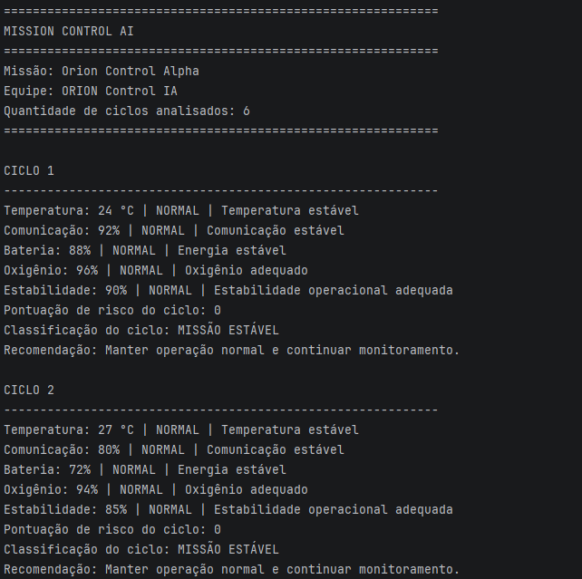
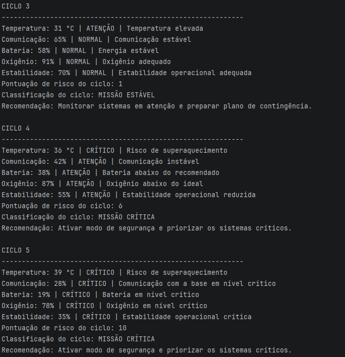
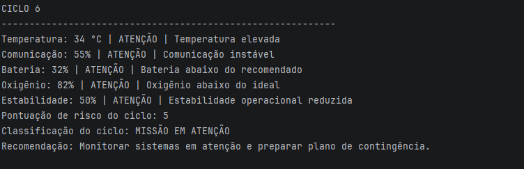
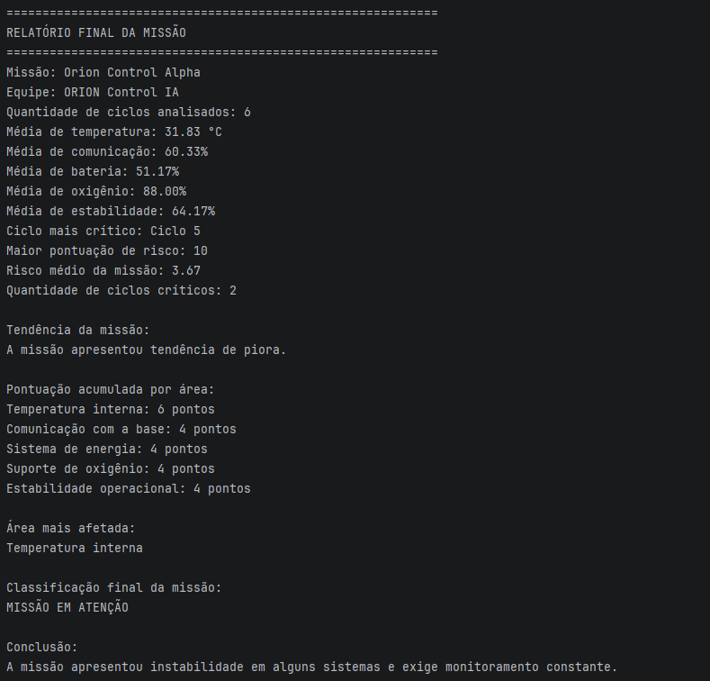

# 🚀 Mission Control AI

## Global Solution 2026.1 – Pensamento Computacional e Automação com Python

### Integrantes

* Arthur Maziviero Faria — RM: 573928
* Tommaso C. Nagliatti — RM: 572147

---

## 📋 Sobre o Projeto

O Mission Control AI é um sistema desenvolvido em Python para simular o monitoramento inteligente de uma missão espacial experimental.

O objetivo do projeto é acompanhar diferentes parâmetros operacionais da missão, analisar possíveis riscos, gerar alertas automáticos e auxiliar a tomada de decisão por meio de regras lógicas.

O sistema realiza a análise de múltiplos ciclos de monitoramento e apresenta um relatório final contendo indicadores de desempenho e risco da missão.

---

## 🎯 Funcionalidades

O sistema é capaz de:

* Monitorar temperatura interna da nave;
* Monitorar qualidade da comunicação com a base;
* Monitorar nível de bateria;
* Monitorar nível de oxigênio;
* Monitorar estabilidade operacional;
* Classificar cada parâmetro como NORMAL, ATENÇÃO ou CRÍTICO;
* Calcular a pontuação de risco de cada ciclo;
* Classificar a situação geral da missão;
* Gerar recomendações automáticas;
* Identificar tendências de melhora ou piora;
* Determinar a área mais afetada durante a missão;
* Exibir um relatório final completo.

---

## 📊 Dados Monitorados

Cada ciclo da missão contém os seguintes dados:

```python
[temperatura, comunicacao, bateria, oxigenio, estabilidade]
```

Exemplo:

```python
[24, 92, 88, 96, 90]
```

Onde:

| Variável     | Descrição                          |
| ------------ | ---------------------------------- |
| Temperatura  | Temperatura interna do módulo (°C) |
| Comunicação  | Qualidade do sinal (%)             |
| Bateria      | Nível de energia (%)               |
| Oxigênio     | Nível de oxigênio disponível (%)   |
| Estabilidade | Estabilidade operacional (%)       |

---

## ⚠️ Regras de Classificação

### Temperatura

* Menor que 18°C → ATENÇÃO
* Entre 18°C e 30°C → NORMAL
* Entre 31°C e 35°C → ATENÇÃO
* Acima de 35°C → CRÍTICO

### Comunicação

* Menor que 30% → CRÍTICO
* Entre 30% e 59% → ATENÇÃO
* 60% ou mais → NORMAL

### Bateria

* Menor que 20% → CRÍTICO
* Entre 20% e 49% → ATENÇÃO
* 50% ou mais → NORMAL

### Oxigênio

* Menor que 80% → CRÍTICO
* Entre 80% e 89% → ATENÇÃO
* 90% ou mais → NORMAL

### Estabilidade

* Menor que 40% → CRÍTICO
* Entre 40% e 69% → ATENÇÃO
* 70% ou mais → NORMAL

---

## 🖥️ Demonstração

### Ciclos 1 e 2



### Ciclos 3, 4 e 5



### Ciclo 6



### Relatório Final



---

## 📈 Análises Realizadas

O sistema executa automaticamente:

* Avaliação individual dos parâmetros;
* Cálculo de risco por ciclo;
* Classificação da missão;
* Identificação da área mais afetada;
* Análise da tendência da missão;
* Emissão de recomendações operacionais;
* Geração de relatório final.

---

## 🛠️ Tecnologias Utilizadas

* Python 3
* Estruturas Condicionais
* Estruturas de Repetição
* Listas
* Matrizes
* Funções
* Lógica de Programação

---

## ▶️ Como Executar

1. Clone o repositório:

```bash
git clone https://github.com/TommasoNagliatti/mission-control-ai.git
```

2. Acesse a pasta do projeto:

```bash
cd mission-control-ai
```

3. Execute o arquivo:

```bash
python mission_control.py
```

---

## 🎥 Vídeo Pitch

Link do vídeo:
https://youtu.be/Qfa60Jr1SKA

---

## 📚 Disciplina

FIAP — Global Solution 2026.1

Pensamento Computacional e Automação com Python

Projeto desenvolvido para o desafio Mission Control AI.
